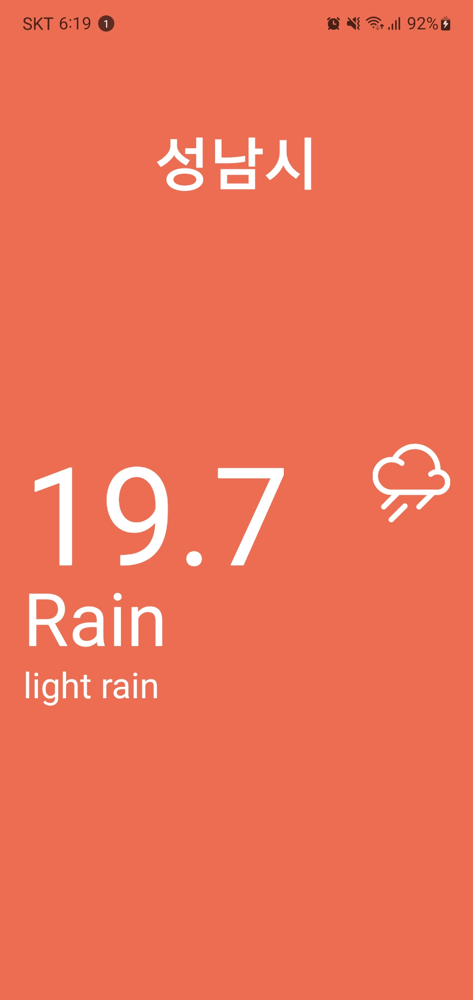

# 날씨앱



<aside>
😆 배움은 언제나 즐거워

# 2.0 snack

- 엑스포의 스낵은 vscode나 node.js가 설치되지 않을 경우, 아이패드나 핸드폰을 이용해서 앱을 만들 수 있다.
- [https://snack.expo.dev](https://snack.expo.dev/)

# 2.1 the rules of native

- view는 컨테이너다.
- 모든 텍스트는 text 컴포넌트에 써야한다. p, span과 같은 태그는 없다.
- StyleSheet.create()은 꼭 필요하지 않다. 태그에 직접 스타일을 넣을 수 있다. 하지만 자동완성을 제공해줘서 편리하다.
- StatusBar는 핸드폰 상단에 시간, 와이파이, 배터리 표시창을 의미한다. “light”로 변경할 시 상태창이 사라진다.

# 2.2 react native packages

- react native docs를 확인하면, 안드로이드에서만 사용할 수 있는 컴포넌트가 있고, ios만 사용할 수 있는 컴포넌트가 있다.
- 개발팀은 과거에 최대한 많은 기능을 제공했으나, 버그가 많아서 이제는 api를 많이 줄였다.

# 2.3 third party packages

- React Native Directory는 서드파티 패키지를 확인해 볼 수 있다. https://reactnative.directory/
- expo sdk는 수많은 api와 컴포넌트가 있다. react native directory에서 패키지를 찾아볼 수 없다면 expo docs를 확인하면 된다. https://docs.expo.dev/versions/latest/
- StatusBar는 expo 버전이 있고, native 버전이 있다. 스테이터스바 뿐만 아니라 커뮤니티 버전의 api와 컴포넌트는 많다. 참고로 스테이터스바는 지워도 사라지지 않는다.

# 2.4 layout system

- 웹에서는 display:flex, flex-direction은 설정할 수 있었다. View태그의 flexDirection은 기본적으로 이미 flex container다. display:flex를 설정하지 않아도 된다. flex-direction 역시 반대반향으로 설정되어 있다. 앱에서는 컬럼이 디폴트.
- 너비와 높이를 이용해서 레이아웃을 디자인 하지 않는다. 아이폰과 안드로이드의 100px은 서로 다르다. 또 반응형으로 만들어야 하기 때문이다. flex를 이용한다. 틸색상의 뷰태그는 다른 요소보다 3배 더 많은 영역을 차지 한다.
- 부모 요소의 flex 설정이 사라지면, 다른 요소 역시 적용되지 않는다.

```jsx
import React from "react";
import { View } from "react-native";

export default function App() {
  return (
    <View style={{ flex: 1, flexDirection: "row" }}>
      <View style={{ flex: 1, backgroundColor: "tomato" }}></View>
      <View style={{ flex: 3, backgroundColor: "teal" }}></View>
      <View style={{ flex: 1, backgroundColor: "orange" }}></View>
    </View>
  );
}
```

# 2.5 styles

```jsx
import React from "react";
import { View, Text, StyleSheet } from "react-native";

export default function App() {
  return (
    <View style={styles.container}>
      <View style={styles.city}>
        <Text style={styles.cityName}>Seoul</Text>
      </View>
      <View style={styles.weather}>
        <View style={styles.day}>
          <Text style={styles.temp}>27</Text>
          <Text style={styles.description}>Sunny</Text>
        </View>
      </View>
    </View>
  );
}

const styles = StyleSheet.create({
  container: {
    flex: 1,
    backgroundColor: "tomato",
  },
  city: {
    flex: 1,
    justifyContent: "center",
    alignItems: "center",
  },
  cityName: {
    fontSize: 48,
    fontWeight: "500",
  },
  weather: {
    flex: 3,
  },
  day: {
    flex: 1,
    alignItems: "center",
    backgroundColor: "teal",
  },
  temp: {
    marginTop: 50,
    fontSize: 158,
  },
  description: {
    marginTop: -30,
    fontSize: 58,
  },
});
```

# 2.6 styles part two

- 뷰는 스크롤이 되지 않는다. ScrollView를 이용해보자. prop으로 horizontal를 주면 횡스크롤을 할 수 있으나, 문제가 생길거다. contentContainerStyle를 이용하면 된다.
- 핸드폰을 양옆으로 쉐이킹 하면 메뉴를 볼 수 있다. 메뉴의 제일 하단에 인스펙터가 있는데, 인스펙터로 화면의 구성요소를 파악하자.
- Dimenstion으로 화면의 전체 크기를 알 수 있다.
- pagingEnabled prop은 컴포넌트를 완전히 넘겨야 전환이 된다.

```jsx
import React from "react";
import { View, ScrollView, Text, StyleSheet, Dimensions } from "react-native";

const { height: SCREEN_HEIGHT, width: SCREEN_WIDTH } = Dimensions.get("window");

export default function App() {
  return (
    <View style={styles.container}>
      <View style={styles.city}>
        <Text style={styles.cityName}>Seoul</Text>
      </View>
      <ScrollView
        pagingEnabled
        horizontal
        showsHorizontalScrollIndicator={false}
        contentContainerStyle={styles.weather}
      >
        <View style={styles.day}>
          <Text style={styles.temp}>27</Text>
          <Text style={styles.description}>Sunny</Text>
        </View>
        <View style={styles.day}>
          <Text style={styles.temp}>27</Text>
          <Text style={styles.description}>Sunny</Text>
        </View>
        <View style={styles.day}>
          <Text style={styles.temp}>27</Text>
          <Text style={styles.description}>Sunny</Text>
        </View>
        <View style={styles.day}>
          <Text style={styles.temp}>27</Text>
          <Text style={styles.description}>Sunny</Text>
        </View>
      </ScrollView>
    </View>
  );
}

const styles = StyleSheet.create({
  container: {
    flex: 1,
    backgroundColor: "tomato",
  },
  city: {
    flex: 1,
    justifyContent: "center",
    alignItems: "center",
  },
  cityName: {
    fontSize: 48,
    fontWeight: "500",
  },
  weather: {},
  day: {
    width: SCREEN_WIDTH,
    alignItems: "center",
  },
  temp: {
    marginTop: 50,
    fontSize: 158,
  },
  description: {
    marginTop: -30,
    fontSize: 58,
  },
});
```

# 2.7 location

- expo install expo-location

```jsx
import React, { useEffect, useState } from "react";
import { View, ScrollView, Text, StyleSheet, Dimensions } from "react-native";
import * as Location from "expo-location";

const { height: SCREEN_HEIGHT, width: SCREEN_WIDTH } = Dimensions.get("window");

export default function App() {
  const [city, setCity] = useState("Loading...");
  const [ok, setOk] = useState(true);

  const getWeather = async () => {
    const { granted } = await Location.requestForegroundPermissionsAsync();

    if (!granted) {
      setOk(false);
    }

    const {
      coords: { latitude, longitude },
    } = await Location.getCurrentPositionAsync({ accuracy: 5 });

    const getLocation = await Location.reverseGeocodeAsync(
      { latitude, longitude },
      { useGoogleMaps: false }
    );

    setCity(getLocation[0].city);
  };

  useEffect(() => {
    getWeather();
  }, []);

  return (
    <View style={styles.container}>
      <View style={styles.city}>
        <Text style={styles.cityName}>{city}</Text>
      </View>
      <ScrollView
        pagingEnabled
        horizontal
        showsHorizontalScrollIndicator={false}
        contentContainerStyle={styles.weather}
      >
        <View style={styles.day}>
          <Text style={styles.temp}>27</Text>
          <Text style={styles.description}>Sunny</Text>
        </View>
        <View style={styles.day}>
          <Text style={styles.temp}>27</Text>
          <Text style={styles.description}>Sunny</Text>
        </View>
        <View style={styles.day}>
          <Text style={styles.temp}>27</Text>
          <Text style={styles.description}>Sunny</Text>
        </View>
        <View style={styles.day}>
          <Text style={styles.temp}>27</Text>
          <Text style={styles.description}>Sunny</Text>
        </View>
      </ScrollView>
    </View>
  );
}

const styles = StyleSheet.create({
  container: {
    flex: 1,
    backgroundColor: "tomato",
  },
  city: {
    flex: 1,
    justifyContent: "center",
    alignItems: "center",
  },
  cityName: {
    fontSize: 48,
    fontWeight: "500",
  },
  weather: {},
  day: {
    width: SCREEN_WIDTH,
    alignItems: "center",
  },
  temp: {
    marginTop: 50,
    fontSize: 158,
  },
  description: {
    marginTop: -30,
    fontSize: 58,
  },
});
```

# 2.8 weather

- https://[openweathermap.org/api](http://openweathermap.org/api) 에서 날씨정보를 가져온다. 회원가입을 하고 api키를 가져오자.

```jsx
import React, { useEffect, useState } from "react";
import {
  View,
  ScrollView,
  Text,
  StyleSheet,
  Dimensions,
  ActivityIndicator,
} from "react-native";
import * as Location from "expo-location";

const { height: SCREEN_HEIGHT, width: SCREEN_WIDTH } = Dimensions.get("window");
const weatherAPI = "####";

export default function App() {
  const [city, setCity] = useState("Loading...");
  const [ok, setOk] = useState(true);
  const [days, setDays] = useState([]);

  const getWeather = async () => {
    const { granted } = await Location.requestForegroundPermissionsAsync();

    if (!granted) {
      setOk(false);
    }

    const {
      coords: { latitude, longitude },
    } = await Location.getCurrentPositionAsync({ accuracy: 5 });

    const getLocation = await Location.reverseGeocodeAsync(
      { latitude, longitude },
      { useGoogleMaps: false }
    );

    setCity(getLocation[0].city);

    const response = await fetch(
      `https://api.openweathermap.org/data/3.0/onecall?lat=${latitude}&lon=${longitude}&exclude={alerts}&appid=${weatherAPI}&units=metric`
    );
    const json = await response.json();
    setDays(json.daily);
  };

  useEffect(() => {
    getWeather();
  }, []);

  return (
    <View style={styles.container}>
      <View style={styles.city}>
        <Text style={styles.cityName}>{city}</Text>
      </View>
      <ScrollView
        pagingEnabled
        horizontal
        showsHorizontalScrollIndicator={false}
        contentContainerStyle={styles.weather}
      >
        {days.length === 0 ? (
          <View style={styles.day}>
            <ActivityIndicator
              color={"white"}
              size={"large"}
              style={{ marginTop: 10 }}
            />
          </View>
        ) : (
          days.map((day, index) => (
            <View key={index} style={styles.day}>
              <Text style={styles.temp}>
                {parseFloat(day.temp.day).toFixed(1)}
              </Text>
              <Text style={styles.description}>{day.weather[0].main}</Text>
              <Text style={styles.tiny_description}>
                {day.weather[0].description}
              </Text>
            </View>
          ))
        )}
      </ScrollView>
    </View>
  );
}

const styles = StyleSheet.create({
  container: {
    flex: 1,
    backgroundColor: "#B5D692",
  },
  city: {
    flex: 1,
    justifyContent: "center",
    alignItems: "center",
  },
  cityName: {
    fontSize: 48,
    fontWeight: "500",
  },
  weather: {},
  day: {
    width: SCREEN_WIDTH,
    alignItems: "center",
  },
  temp: {
    marginTop: 50,
    fontSize: 108,
  },
  description: {
    marginTop: -30,
    fontSize: 58,
  },
  tiny_description: {
    fontSize: 28,
  },
});
```

# 2.9 recap

# 2.10 icons

- https://icons.expo.fyi 여러 아이콘을 확인할 수 있다. `expo init` 을 이용해서 앱설정을 했다면 아이콘을 쉽게 가져다 사용할 수 있다.
- 기존의 스타일 가져오면서 특정 태그에 커스터마이즈하기

```jsx
<View style={{ ...styles.day, alignItems: "center" }}>
  <ActivityIndicator color={"white"} size={"large"} style={{ marginTop: 10 }} />
</View>
```

</aside>
